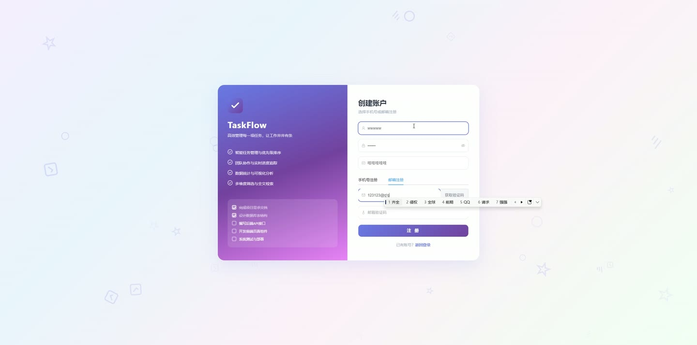
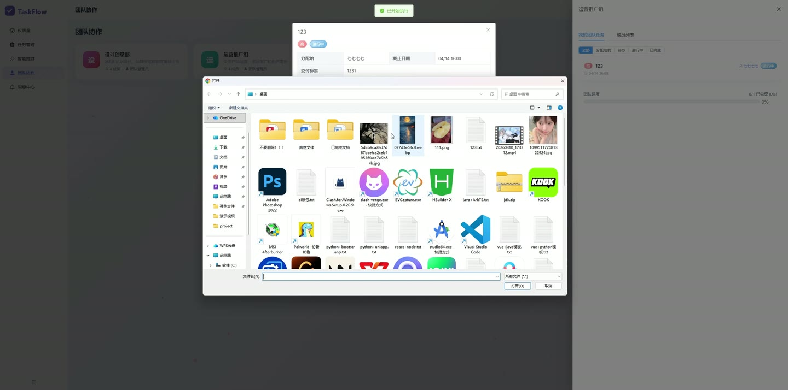
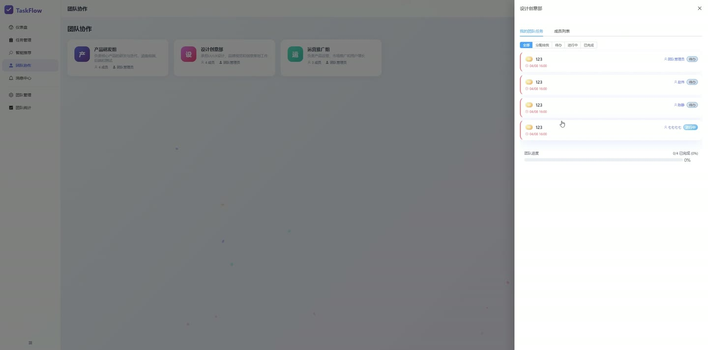
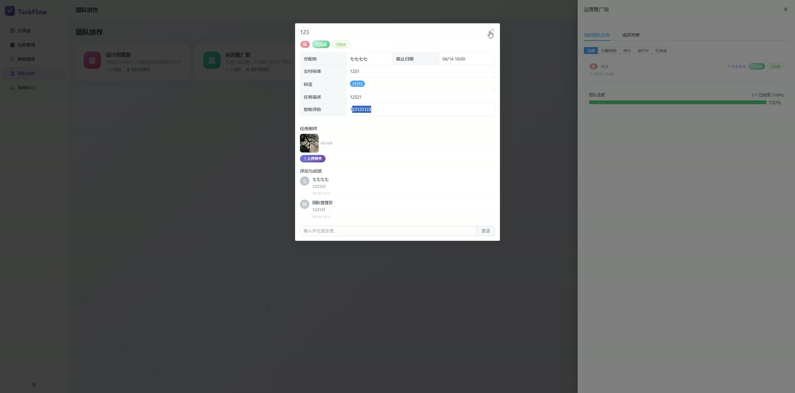
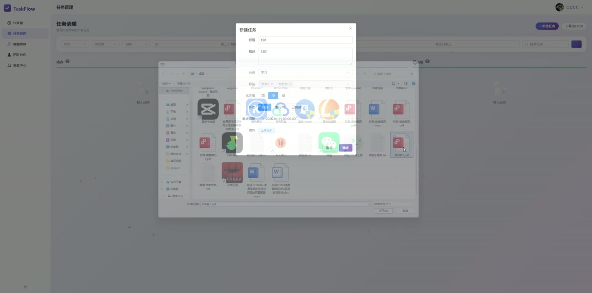
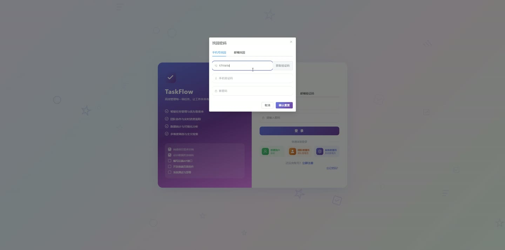

# (附文档)Springboot3+Vue3+MySQL 在线TODO清单系统

**技术栈**：Springboot3、Vue3、MySQL

### 系统简介

本系统是一套基于 Spring Boot 3 + Vue 3 + MySQL 的在线 TODO 清单管理系统，采用前后端分离架构。系统支持普通用户与管理员双角色，提供任务全生命周期管理、团队协作、智能提醒、数据统计与备份恢复等功能，适用于个人效率提升及小型团队任务管理。
 
### 核心功能
 
### 普通用户端

 
- 任务列表分页查询，支持按状态（TODO/IN_PROGRESS/DONE）、优先级（HIGH/MEDIUM/LOW）、分类、关键字、截止日期范围筛选 
- 创建任务，填写标题、描述、分类、优先级、截止日期、标签等字段 
- 编辑任务基本信息，包括标题、描述、分类、优先级、截止日期、标签等 
- 删除任务，支持单个删除 
- 完成任务，一键将任务状态标记为 DONE 并记录完成时间 
- 查看任务详情，显示分类名称、指派人名称等关联信息 
- 任务评论管理，查看指定任务的评论列表（按时间升序），发表评论，删除自己的评论 
- 任务附件管理，上传文件（支持限制单文件大小与用户总存储容量），查看任务附件列表，删除附件 
- 导出个人任务为 Excel 文件，包含标题、描述、分类、优先级、状态、截止日期、创建时间 
- 个人仪表盘统计，查看任务状态分布（待办/进行中/已完成）、分类统计、近 6 个月完成趋势 
- 智能推荐任务列表，系统根据优先级、截止日期紧迫度、完成率计算分数并排序返回前 10 条 
- 智能摘要，展示总任务数、已完成数、完成率、逾期任务数、48 小时内到期任务数 
- 消息通知，查看个人消息列表，标记单条消息已读，一键标记全部已读，查看未读消息数量 
- 个人资料管理，查看/编辑昵称、邮箱、手机号，上传头像，修改登录密码 
- 团队管理，查看我加入的团队列表与创建的团队列表，创建团队（自动成为拥有者） 
- 查看团队成员列表（显示昵称、头像、邮箱），添加成员（指定权限：ASSIGN/EDIT/VIEW），移除成员，修改成员权限 
- 创建团队任务（自动关联团队 ID），查看团队任务列表，分配任务给成员，接受/拒绝任务并填写备注 
- 团队统计面板，查看任务总数、已完成/进行中/待办/逾期数量、完成率、成员工作量分布、近 14 天完成趋势、优先级分布
 
### 管理员端

 
- 用户管理，分页查询用户列表，支持按关键字、角色、状态筛选 
- 冻结/解冻用户账号，冻结后用户无法登录 
- 审核用户注册，通过/拒绝待审核用户（状态为 2 的用户） 
- 重置用户密码，管理员可指定新密码（默认 123456） 
- 删除用户（物理删除，不能删除自己的账号） 
- 系统概览统计，查看总用户数、总任务数、总团队数、活跃任务数、已完成任务数、近 7 天活跃用户数 
- 月度任务统计，查看近 6 个月每月创建任务数量 
- 操作日志管理，分页查看所有用户的操作日志（按时间倒序） 
- 系统配置管理，查看所有配置项列表，修改配置项的值（如最大上传大小、用户存储上限、提醒间隔等） 
- 标签库管理，查看所有标签，新增标签，编辑标签名称，删除标签 
- 附件管理，分页查看所有附件（支持按文件名搜索），删除附件 
- 评论管理，分页查看所有评论（支持按内容搜索），删除评论 
- 数据库备份，手动触发备份（生成 .sql 文件），查看备份文件列表，下载备份文件，上传备份文件恢复数据库 
- 自动备份，系统每天凌晨 2 点自动备份，自动清理 30 天前的旧备份
 
### 技术栈

 后端框架Spring Boot 3 ORMMyBatis-Plus 权限认证Spring Security + JWT 前端框架Vue 3 状态管理Pinia 构建工具Vite 数据库MySQL Excel 导出Apache POI
 
### 交付内容

 
- 后端完整源码 
- 前端完整源码 
- 数据库初始化脚本 
- 万字文档

## 界面展示

---

## 获取完整源码 + 万字文档

本仓库为项目介绍页。**完整前后端源码、数据库初始化脚本、万字项目文档**，请加微信 `kangkangcode`，或访问 [codekk.top](http://codekk.top) 获取。

可作课程设计 / 毕业设计参考，支持远程部署调试。